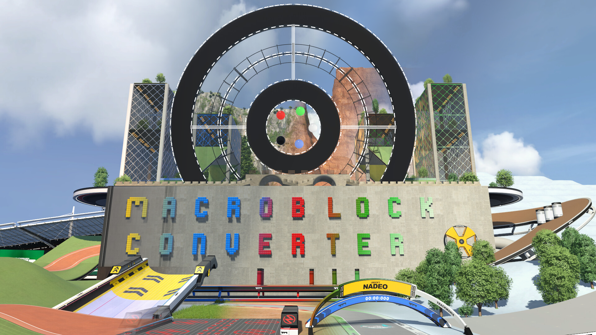
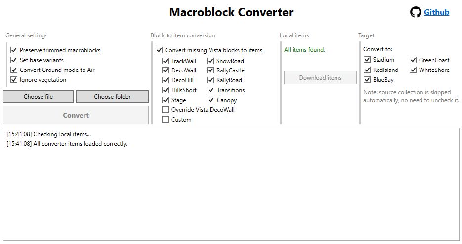

# MacroBlock Converter

A [GBX.NET](https://github.com/BigBang1112/gbx-net) app that allows you to convert macroblocks between the five TM2020 collections (Stadium, Red Island, Green Coast, Blue Bay, White Shore).




## Install guide

Go to [Releases](https://github.com/kjossul/MacroblockConverter/releases/latest), download the zip file, extract it and run the executable.

## Usage

On the left, you'll find two buttons that let you choose your macroblocks to convert. You can either choose each file individually, or you can select a folder and the program will look recursively for all macroblocks in the path.

Once the macroblock(s) are selected, the `Convert` button will become available. Click it, and you'll find the converted macroblocks into `<Trackmania_Documents>/Blocks/<Target_Collection>/<Source_Collection>Converted/`, preserving the original filepath structure.

## Options guide
- `Preserve trimmed macroblocks`: if this is checked, macroblocks with invalid blocks will still be converted, but the invalid blocks will be removed. If this is unchecked, the macroblock gets skipped completely.
- `Set base variants`: convert blocks by only preserving the placement mode, and setting variants to 0. **You most likely want to keep this checked**, because the game will crash if you try to open the editor when you have a macroblock with invalid block variants. Currently, I'm just preserving the variant of `StructureSupport` and `StageTechnicsLight`, which I know can be converted safely. If you know of other blocks that have all variants shared across all collections, please let me know.
- `Convert Ground mode to Air`: since Vistas have terrain, you can have macroblocks with blocks in ground mode at different heights. The game will not let you place a macroblock if it cannot find a way to have terrain under the ground blocks, so with this option you can make sure to bypass this restriction.
- `Ignore Vegetation`: with this checked, all trees and vegetation will be removed from the macroblock. Useful if you're macroblocking a full map, and don't want vegetation floating around in the converted macroblock.

### Converting blocks to items
Vistas have a severely trimmed set of blocks compared to Stadium. This option will allow you to convert blocks into items. Beware that items get embedded into the map, and there is a hard 5MB item limit for maps to be playable online, so keep a check on the size of embedded items.

At first launch, you'll be missing the items required for this option to work. Just click the download button and wait patiently for `items.zip` to be downloaded and extracted. They will be extracted to `Items/0-B-NoUpload/MacroblockConverter`. This path avoids conflict with the widely used [TrackmaniaItemsSorted](https://github.com/ski-freak/TrackmaniaItemsSorted) items collection made by SkiFreak.

> [!IMPORTANT]
> I'm using a lot of items that have been converted automatically from blocks inside the MeshModeller. These have a bloated size and bad lightmap. If you want to contribute, please consider making a pull request with better items.

To reduce the amount of embedded items, the program allows you to pick and choose which collection of blocks to convert. This is the currently available list, and the origin of the item set:

| Set Name | Source | Notes |
|---|---|---|
| TrackWall | MeshModeller | [Link](https://github.com/RuurdBijlsma/tm-convert-blocks-to-items/releases/tag/07-04-22) |
| DecoWall | MeshModeller | [Link](https://github.com/RuurdBijlsma/tm-convert-blocks-to-items/releases/tag/07-04-22) |
| DecoHill | MeshModeller | [Link](https://github.com/RuurdBijlsma/tm-convert-blocks-to-items/releases/tag/07-04-22) |
| HillsShort | MeshModeller | [Link](https://github.com/RuurdBijlsma/tm-convert-blocks-to-items/releases/tag/07-04-22). Some textures are weird. |
| SnowRoad | [Vista Wood by Yin_TM](https://item.exchange/set/view/13284) | AKA wood |
| RallyCastle | [Vista Castle by Yin_TM](https://item.exchange/set/view/13285) | Clips need to be placed manually |
| RallyRoad | [Vista Rally by Yin_TM](https://item.exchange/set/view/13297) | Clips need to be placed manually |
| Transitions | [Vista Transitions by Yin_TM](https://item.exchange/set/view/13290) | Road/Platform to TrackWall/DecoWall |
| Stage | MeshModeller | Manually made by me |
| Canopy | MeshModeller | Manually made by me |

There is an additional option called `Override Vista DecoWall`. Vistas have a limited amount of blocks with the same shape of `DecoWall`, namely:
```
DecoWallBase
PlatformBase
DecoWallSlope2Straight
DecoWallDiag1
DecoWallDiag1Slope2DownLeft
DecoWallDiag1Slope2DownRight
DecoWallDiag1Slope2UpLeft
DecoWallDiag1Slope2UpRight
```
However, these blocks have different textures in Stadium. For this reason, you might want to have the specified option checked, so that your Stadium macroblocks will come with the same textures.
### Custom conversions

Many of these items have a huge size. This means that, for instance, converting a full wood route will likely result in exceeding the allowed embedded items size.

My main use case for this application was converting scenery macroblocks (like the amazing [modular scenery](https://item.exchange/set/view/12042) and its [expansion](https://item.exchange/set/view/12798)), so I don't have need to convert more than a couple of items per map. 
However, if you find yourself short of embedded items size, you can instruct the program to convert to smaller items by modifying `conversions.json` with the specified item.

For example, assuming you have the same file structure in [TrackmaniaItemsSorted](https://github.com/ski-freak/TrackmaniaItemsSorted), you could replace this line in the json file
```
"SnowRoadStraight": "0-B-NoUpload/MacroblockConverter/wood/1/STRT.Item.Gbx",
```
with
```
"SnowRoadStraight": "a-jRoad/Roadwood/9_RoadWoodFlat/9_RoadWoodFlatMain/9_RoadWoodStraight.Item.Gbx",
```

You can either modify the `SnowRoad` section directly, or add this line into the `Custom` section instead. If you decide for the second option, make sure to convert with `SnowRoad` unchecked to make sure the conversion works properly.

## Contributing and Future Updates

I'm not an experienced C# dev, so any PR is welcome! Here are some things that I plan to implement eventually:

- **Storing user preferences** on file so the gui preserves states between sections.
- **Handle terrain**: theoretically, we should be able to convert terrain between the 4 Vistas.
- **Preserving penalty surface**: Vistas only have one penalty surface in their blockset. Currently, the app simply removes the penalty type during conversion. This means that macroblocks with penalty grass, sand and snow in Stadium would all be converted into sand blocks in Red Island, for instance. An option to preserve penalty surface through custom items would be highly useful!
- **DecoWallSlope2Straight insertions**: there are some blocks, like `DecoHill`, that contain wood pillars in some variants, which are lost during conversion. It would be useful to insert the Slope2 block present in the vista beneath them to preserve scenery. 
- **Code documentation**


## Thanks to

Special thanks to:
- BigBang1112 for the amazing work on [GBX.NET](https://github.com/BigBang1112/gbx-net).
- Zai for letting me know about the issue with block variants and giving me tips.
